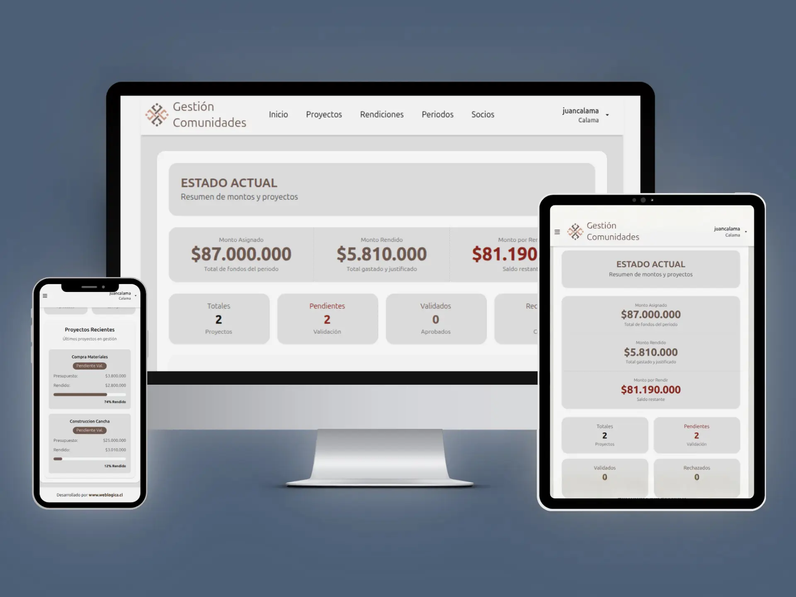

# 🏢 Auditoriapp - SaaS de Gestión de Fondos


> **Plataforma SaaS diseñada para la auditoría, trazabilidad y gestión transparente de fondos de proyectos para múltiples entidades beneficiarias.**

Este sistema reemplaza flujos de trabajo manuales y opacos (Excel/PDFs) por una solución digital centralizada que garantiza el **aislamiento de datos** entre comunidades y ofrece herramientas de supervisión en tiempo real para los auditores.

---

## 📸 Vistas del Sistema


| Dashboard General (KPIs) | Gestión de Rendiciones |
|:---:|:---:|
|  |  |

---

## 🚀 Arquitectura & Características Clave

El núcleo del sistema es su arquitectura **Multi-Tenant Lógica**, asegurando que cada organización acceda únicamente a sus propios datos.

* **🔐 Aislamiento de Datos (Multi-Tenancy):** Implementación de filtros a nivel de ORM para segregar la información de cada entidad beneficiaria.
* **👥 Seguridad RBAC (Role-Based Access Control):**
    * **Admin Comunidad:** Gestión total de sus proyectos y rendiciones.
    * **Auditor Central:** Visibilidad transversal de todas las entidades para validación y control.
* **💰 Trazabilidad Financiera:** Flujo completo desde la asignación del presupuesto (Periodos) hasta la justificación del gasto (Rendiciones).
* **📊 Visualización de Datos:** Gráficos interactivos (Recharts) para el monitoreo de ejecución presupuestaria.
* **📄 Gestión Documental:** Sistema de carga y validación de evidencias (PDFs, Facturas) asociado a cada movimiento.

---

## 🛠️ Tech Stack

### Backend (Core)


### Frontend (Cliente)


---

## 📂 Estructura del Proyecto

```bash
Auditoriapp/
├── backend/
│   ├── core/            # Configuración principal y Middlewares
│   ├── usuarios/        # Gestión de Auth y Roles
│   ├── comunidades/     # Lógica Multi-tenant
│   ├── proyectos/       # Core business: Proyectos y Presupuestos
│   └── rendiciones/     # Gestión de gastos y evidencias
├── frontend/
│   ├── src/
│   │   ├── components/  # UI Reutilizable (Tablas, Modales)
│   │   ├── pages/       # Vistas (Dashboard, Login)
│   │   └── context/     # Estado global (AuthContext)
└── README.md

```
## 🔧 Instalación Local


Backend

Bash
cd backend
python -m venv venv
source venv/bin/activate
pip install -r requirements.txt
python manage.py migrate
python manage.py runserver
Frontend
Bash

cd frontend
npm install
npm run dev


## 🔑 Variables de Entorno
<br>
Configuración necesaria en .env:

Fragmento de código

# Django Settings
SECRET_KEY=tu_clave_secreta
DEBUG=True
ALLOWED_HOSTS=*

### Base de Datos
DB_NAME=auditoria_db
DB_USER=admin
DB_PASSWORD=password
DB_HOST=localhost

####  JWT Settings
JWT_ACCESS_TOKEN_LIFETIME=60
JWT_REFRESH_TOKEN_LIFETIME=1440


## 👤 Autor

Cristian Godoy Angel Fullstack Developer

[](https://www.linkedin.com/in/cristian-godoy-angel/)


